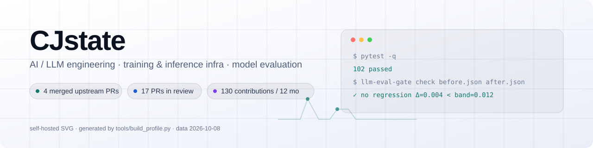
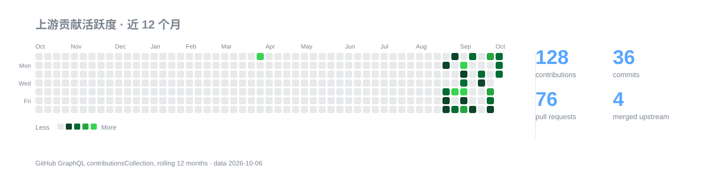

<div align="center">

<picture>
  <source media="(prefers-color-scheme: dark)" srcset="docs/banner-dark.svg">
  <source media="(prefers-color-scheme: light)" srcset="docs/banner-light.svg">
  
</picture>

**AI / LLM 工程 · 训练与推理基础设施 · 模型评测 · 跨平台 / Windows DX**

<sub>AI / LLM engineering · training &amp; inference infra · evaluation tooling · cross-platform (Windows) DX</sub>


</div>

## 📌 概览



| 指标 | 数值 | 来源 |
| --- | --- | --- |
| 近 12 个月 contributions | 124 | GraphQL `contributionsCollection`（滚动 12 个月） |
| commits / pull requests | 33 / 76 | 同上 |
| 已合并的上游 PR | 4 | `author:CJstate is:pr is:merged` |
| 改动已落地的上游仓库 | 3 个 · 合计 122,102★ | `author:CJstate is:pr is:merged` |
| 正在评审的上游 PR | 16 | `author:CJstate is:pr is:open` |
| 公开仓库 | 15（其中 13 个 fork 就是上面这些 PR 的分支源） | `GET /users/CJstate` |

## ✅ 已合并的上游贡献（4）

这些改动已经进了上游主干，可以直接点开 commit 看 diff：

| 项目 | PR | 做了什么 | 合并日期 |
| --- | --- | --- | --- |
| [`pranshuparmar/witr`](https://github.com/pranshuparmar/witr) 22.6k★ | [#242](https://github.com/pranshuparmar/witr/pull/242) | 根 `main.go` 是受版本控制的符号链接，Git for Windows 检出后 `go build` / `go test` 全废；改为真实入口并把入口逻辑抽到 `internal/app.Main()` | 2026-10-04 |
| [`pranshuparmar/witr`](https://github.com/pranshuparmar/witr) 22.6k★ | [#239](https://github.com/pranshuparmar/witr/pull/239) | 不支持高亮 ANSI 的终端上，`--help` 的配色图例被静默降级；改为按终端能力逐级回退 | 2026-10-03 |
| [`nvm-sh/nvm`](https://github.com/nvm-sh/nvm) 95.3k★ | [#3915](https://github.com/nvm-sh/nvm/pull/3915) | `nvm --help` 里 set-colors 的图例显示为未着色文本；改为在 help 分支里应用同一套颜色变量 | 2026-09-03 |
| [`DependencyTrack/dependency-track`](https://github.com/DependencyTrack/dependency-track) 4.3k★ | [#7096](https://github.com/DependencyTrack/dependency-track/pull/7096) | README 的 CI 徽章指向已废弃的分支，点开是 404；改指 `main` | 2026-08-24 |

## 🔬 三个深挖案例

数量上我远不是最活跃的贡献者，所以我把重点放在「根因讲清楚、证据能复现」上。

### 1. simonw/llm#1737 —— 写模板用 UTF-8，读回来却用系统 locale 编码

| | |
| --- | --- |
| **现象** | 在默认编码为 `cp936` 的 Windows 上，把模板存成 UTF-8 再 `llm -t 模板` 直接失败：`UnicodeDecodeError: 'gbk' codec can't decode byte 0xaa in position 16`。`-f 片段.md` 与 `--functions 工具.py` 两个入口同样打不开。 |
| **根因** | 模块跟自己不一致：`llm templates edit` 新建模板时写的是 `path.write_text(DEFAULT_TEMPLATE, "utf-8")`（`llm/cli.py:2646`），而 `load_template()` 读回时是 `path.read_text()`（`llm/cli.py:4274`）——用的是 locale 默认编码。片段与 `--functions` 两处（`llm/cli.py:293`、`llm/cli.py:4287`）完全相同。 |
| **修复** | 抽出 `_read_text_file()`：先按 UTF-8 读，只有文件确实不是合法 UTF-8 时才回退到 locale 默认编码，所以原本用 GBK / CP1252 保存的旧文件不会被弄坏。这个逐编码回退的写法与仓库里 `llm embed-multi --files` 已有的 `("utf-8", "latin-1")` 处理保持一致。 |
| **证据** | 新增 3 个回归测试（模板 / 片段 / `--functions` 文件），用一个在任意平台上模拟「locale 不是 UTF-8」的 fixture 驱动。改之前三条全挂：`UnicodeDecodeError: 'ascii' codec can't decode byte 0xe7 in position 8`；改之后 `3 passed`，全量测试 `1185 passed, 1 skipped, 6 xfailed, 15 xpassed`。 |

[打开 PR](https://github.com/simonw/llm/pull/1737)

### 2. pranshuparmar/witr#242 —— CI 全绿，但真实 Windows 检出连编译都过不去（已合并）

| | |
| --- | --- |
| **现象** | `git clone` 之后 `go build ./...` 立刻失败：`main.go:1:1: expected 'package', found cmd`，`go test ./...` 直接 `[setup failed]`，`make test` / `make lint` 在这台机器上全废。而仓库的 `Tests: Unit (windows-latest)` 是**绿的**。 |
| **根因** | `git ls-files -s main.go` 显示 mode `120000`——根入口是个符号链接，指向 `cmd/witr/main.go`。Git for Windows 默认 `core.symlinks=false`，符号链接落盘成一个 16 字节的普通文本文件，内容就是字符串 `cmd/witr/main.go`，于是根目录多了一个不是合法 Go 包的 `.go` 文件。CI 之所以掩盖了它，是因为 `actions/checkout` 会真的创建符号链接。 |
| **修复** | 根入口改为真实文件，并把入口逻辑抽到 `internal/app.Main()`（`SetVersion` + `Execute`），根包与 `cmd/witr` 共用同一份实现；lint job 里加一条守卫：受版本控制的文件不允许是 `120000`。 |
| **证据** | `go build ./...` / `go vet ./...` / `gofmt -l .` / `go test ./...` 全部通过；linux（amd64、loong64）、darwin（amd64、arm64）、freebsd/amd64、windows（amd64、arm64）七组交叉编译全部 exit 0；`go build .` 与 `go build ./cmd/witr` 两个产物的 `--help`（2237 字符）和 `--version` 输出逐字节一致——证明重构没有改变任何用户可见行为。 |

[打开 PR](https://github.com/pranshuparmar/witr/pull/242)

### 3. huggingface/accelerate#4360 —— `debug_launcher` 里的三处 Unix-only 假设

| | |
| --- | --- |
| **现象** | Windows 上 `accelerate debug_launcher script.py` 起不来：先是 `ValueError: cannot find context for 'fork'`；绕过之后变成 `PermissionError: [Errno 13]`，子进程打不开 rendezvous 文件。 |
| **根因** | 三处只在 Unix 成立的前提：(1) 硬编码 `start_method="fork"`，而 Windows 只有 `spawn`；(2) rendezvous 文件用 `NamedTemporaryFile` 创建，文件句柄留在父进程，spawn 出来的子进程无法打开一个仍被别处持有的文件；(3) 无条件设置 `gloo_socket_ifname="lo"`，但 Windows 的环回接口不叫 `lo`。 |
| **修复** | `_debug_start_method()` 按平台实际能力在 `fork` / `spawn` 之间选择；`NamedTemporaryFile` 换成 `TemporaryDirectory`（只把路径传下去，谁都不持有句柄）；`_has_loopback_alias()` 先探测 `lo` 是否存在，只在存在时才设置该环境变量。 |
| **证据** | 本机 Windows 复现 → 修复后 `debug_launcher` 可正常启动多进程调试；相关测试在本机 Python 3.13 + torch 2.9 上通过（`spawn` 分支需要 `if __name__ == "__main__"` 守卫，这一点写进了 docstring）；PR 目前等维护者批准 workflow 后跑 CI。 |

[打开 PR](https://github.com/huggingface/accelerate/pull/4360)

## 🔄 正在评审的上游 PR（16）

### 训练与推理框架（6）

| PR | 内容 | 当前状态 |
| --- | --- | --- |
| [#4361](https://github.com/huggingface/accelerate/pull/4361) `huggingface/accelerate` | checkpoint 随机状态无法恢复时只静默继续，改为按 rank 一次性告警，避免复现性无声漂移 | 等维护者批准 workflow |
| [#4360](https://github.com/huggingface/accelerate/pull/4360) `huggingface/accelerate` | `debug_launcher` 在 Windows 上无法启动（fork / NamedTemporaryFile / gloo 网卡名三处 Unix-only 假设） | 等维护者批准 workflow |
| [#21975](https://github.com/Lightning-AI/pytorch-lightning/pull/21975) `Lightning-AI/pytorch-lightning` | `Trainer(enable_device_summary=...)` 与既有参数组合时的行为不一致，补上开关与文档 | 等维护者批准 workflow |
| [#8693](https://github.com/huggingface/datasets/pull/8693) `huggingface/datasets` | `Dataset.from_dict` 的注解接受 `List[...]` 却拒绝等价的 `Sequence[...]`，补齐类型注解判定 | 等维护者批准 workflow |
| [#21974](https://github.com/Lightning-AI/pytorch-lightning/pull/21974) `Lightning-AI/pytorch-lightning` | 文档里 `:emphasize-lines:` 的行号在包含代码换行时整体偏移，改为按渲染后的行计算 | 等维护者批准 workflow |
| [#21939](https://github.com/Lightning-AI/pytorch-lightning/pull/21939) `Lightning-AI/pytorch-lightning` | Windows 上无符号链接权限时测试直接报错，改为跳过并说明原因，而不是判失败 | 等维护者批准 workflow |

### 评测与可观测性（4）

| PR | 内容 | 当前状态 |
| --- | --- | --- |
| [#26206](https://github.com/mlflow/mlflow/pull/26206) `mlflow/mlflow` | artifact 预览里的图片被强制缩放，小图放大后糊成一片；改为按容器宽度自适应 | 等 core maintainer approval（fork PR 门禁） |
| [#4216](https://github.com/EleutherAI/lm-evaluation-harness/pull/4216) `EleutherAI/lm-evaluation-harness` | `make_table` 对共享子任务重复计数，导致评测表格里的样本数与实际不符 | 等维护者批准 workflow + 签 CLA |
| [#4484](https://github.com/traceloop/openllmetry/pull/4484) `traceloop/openllmetry` | Groq 流式响应的 usage 指标丢失，补上流式路径的 token 统计并加指标回归测试 | 已 rebase 到最新 main，等 review |
| [#4114](https://github.com/EleutherAI/lm-evaluation-harness/pull/4114) `EleutherAI/lm-evaluation-harness` | `simple_evaluate` 对非法输入静默返回空结果，补上输入校验与回归测试 | 等维护者批准 workflow + 签 CLA |

### 工具链 / 平台 DX（6）

| PR | 内容 | 当前状态 |
| --- | --- | --- |
| [#1737](https://github.com/simonw/llm/pull/1737) `simonw/llm` | `llm templates edit` 按 UTF-8 写模板，读回却用 locale 编码，中文 Windows 上模板 / `-f` 片段 / `--functions` 文件直接解码失败；统一改为 UTF-8 优先、locale 回退，并补回归测试 | 等维护者批准 workflow |
| [#855](https://github.com/k8sgpt-ai/k8sgpt-operator/pull/855) `k8sgpt-ai/k8sgpt-operator` | 为 `K8sGPT` CRD 与 chart 增加 tolerations 支持，让控制器能调度到被 taint 的节点 | 已 approved，等维护者裁量 #820 vs #855 |
| [#114](https://github.com/browser-use/jev-ultrafast/pull/114) `browser-use/jev-ultrafast` | no-progress guard 把「本轮没有观测到结果」误判成「没有进展」，导致有效的长任务被提前中断 | clean，等 review |
| [#1720](https://github.com/anthropics/skills/pull/1720) `anthropics/skills` | `mcp-builder` 生成评估报告时按 locale 编码写文件，在中文 Windows 上产出乱码；显式写 UTF-8 | 等 review |
| [#7217](https://github.com/public-apis/public-apis/pull/7217) `public-apis/public-apis` | Pirate Weather 条目指向已失效的地址，换成可访问的官方入口 | clean，等 review |
| [#72](https://github.com/Nutlope/hallmark/pull/72) `Nutlope/hallmark` | 补上 macrostructure 的文档说明，让生成的页面结构可预期（纯文档） | 等 review |

## 🧰 自己的项目

### [`llm-eval-gate`](https://github.com/CJstate/llm-eval-gate) — 把「评测退化」变成可执行的 CI 判定

给它两份 lm-evaluation-harness 的结果文件（`before` / `after`），它在**考虑随机波动**的前提下判断这次评测是不是
真的退化了：用相对阈值 + 基于标准误的噪声带，而不是「小数点后几位变小了就红」。LLM 评测本身噪声就大，
判据写错只有两种下场——天天假警报，或者把真回归放过去。

- `v0.1.0` 已发版；102 个测试（`pytest --collect-only -q` 可复现）
- GitHub Actions 在 Ubuntu（Python 3.11 / 3.12 / 3.13）+ Windows + macOS 上全绿，并且会把自己当 Action 跑一遍（`self-gate`）
- **零运行时依赖**（`pyproject.toml` 里 `dependencies = []`），不绑定具体模型，只吃 harness 的结果文件

```bash
pip install "git+https://github.com/CJstate/llm-eval-gate@v0.1.0"
llm-eval-gate check before.json after.json     # 退出码就是 CI 判定结果
```

## 🧭 我的工作方式

| 习惯 | 说明 |
| --- | --- |
| **先复现，再改代码** | 每个修复都从一条能贴出来的失败信息开始（`failure` 优先于「看起来应该修一下」），修完再贴修复后的输出。上面三个案例的「现象」一栏都是原始报错。 |
| **最小 diff + 回归测试** | 只动根因相关的那几行，不夹带格式化、重命名和顺手重构；能写测试的地方一定带一个会先失败的测试。 |
| **挑环境类缺陷，而不是抢热点** | 我熟悉的是「只在真实环境里出现」的那类 bug：非 UTF-8 默认编码、Windows 检出、首次贡献者的 CI 门禁、跨平台终端能力差异。这类问题复现成本高、报告少；但也最容易被判 low impact：必须能说清「谁真的会踩到」，否则再干净的修复也只是噪声。 |
| **踩过的坑写进公开复盘** | 早期提交过多余的文档与格式改动，被维护者当作噪声关掉；后来一个能稳定复现的编码缺陷，仍然被判 low impact——理由是没有真实用户报告，复现是「合成的」。所以现在提交前会先问：这个问题有人真的踩到吗？没有就先去找真实报告或明确使用场景，被指出问题时也公开更正自己的判断。 |

## 🧱 技术栈

| 方向 | 常用 |
| --- | --- |
| **语言** | Python（3.9–3.13）· Go · TypeScript · Shell · PowerShell |
| **训练 / 推理** | PyTorch · 🤗 Transformers · 🤗 Accelerate · 🤗 PEFT · FSDP · DeepSpeed · vLLM |
| **数据 / 评测** | 🤗 Datasets · lm-evaluation-harness · MLflow · OpenLLMetry / OpenTelemetry |
| **工程** | pytest / pytest-mock · ruff · mypy · GitHub Actions（含 Windows / macOS matrix）· Docker · k8s |
| **平台** | Windows 与 Linux 双栈 · 终端能力探测 · 编码 / locale 兼容 · 交叉编译 |
